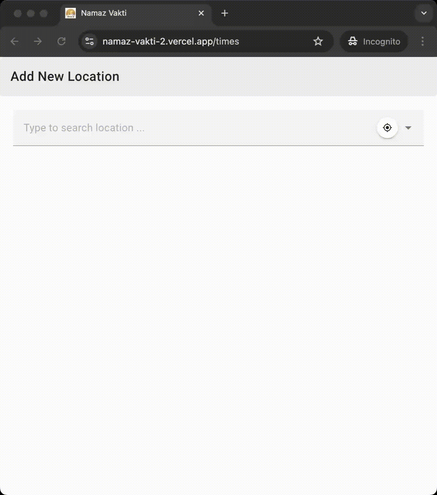

# irem [(Türkçe)](BENİOKU.md) 

 | 

Search for any place in any language in earth.

<p align="center">
    
</p>

## Irem: A Multilingual Place Search API and Database for Developers

Irem is a Node.js library that integrates a comprehensive, well-structured geospatial database with an efficient querying API. Designed to simplify the integration of global place search functionality into applications, Irem supports multilingual searches, making it a versatile choice for modern, internationalized projects.

- **Extensive Geospatial Data:**  
  Access a meticulously curated database of over 350,000 entries, including cities, towns, regions, and other inhabited places worldwide, complete with GPS coordinates and alternative names.

- **Multilingual Search Support:**  
  Query place names in multiple languages, enabling seamless internationalization.

- **Integrated Querying Layer:**  
  Optimized API for performing precise and efficient place searches directly in your application.

- **Developer-Focused:**  
  Provides a straightforward and robust interface designed to minimize complexity and maximize performance.

- **Scalable and Flexible:**  
  Ideal for use cases ranging from mapping services and travel apps to e-commerce localization and geospatial analytics.
 
## Usage

### Use [npm](https://www.npmjs.com/package/irem)

Run command `npm i irem`

### Use free API

[Search for "Keçi" in Turkish](https://vakit.vercel.app/api/searchPlaces?q=Keçi&lang=tr)

[Search for "伊斯坦布尔" (Istanbul)](https://vakit.vercel.app/api/searchPlaces?q=%E4%BC%8A%E6%96%AF%E5%9D%A6%E5%B8%83%E5%B0%94)

[Nearby places around Ankara,Turkiye](https://vakit.vercel.app/api/nearByPlaces?lat=40.0006929&lng=32.8519762&lang=tr)

[Get place by id](https://vakit.vercel.app/api/placeById?id=311034)

Works only in nodejs environment. Stores data in the folder named `data` in TSV file format or gzipped format or in binary format.

<p align="center">
    
</p>

## Documentation

### import ESM module

`import { getPlaceSuggestionsByText, getNearbyPlaces, getPlaceById } from 'irem';`

### function getPlaceSuggestionsByText

Returns a list of places based on search term in given language. if latitude and longitude is provided, the list is sorted by distance, otherwise sorted by text match. countryCode is a two letters string represents a country such as TR or US. If it's provided, results from the country will have precedence. maxResultCount is the size of returned array length. It should be in [0,100] range If language is undefined, results will be returned in English.

```
async function getPlaceSuggestionsByText(
  searchTerm: string,
  language?: SupportedLanguage,
  latitude?: number,
  longitude?: number,
  maxResultCount = 10,
  countryCode: CountryCode | "" = "",
): Promise<PlaceMatchWithCountry[]>
```

### function getNearbyPlaces

Returns a list of places based on provided `latitude` and `longitude` values in given language. The list is sorted by distance.
`maxResultCount` is the size of returned array length. It should be in [0,100] range

```
async function getNearbyPlaces(
  latitude: number,
  longitude: number,
  language?: SupportedLanguage,
  maxResultCount = 10,
): Promise<PlaceWithCountry[]>
```

### function getPlaceById

Returns a `PlaceWithCountry` object from provided id. Id must exist in `db.tsv` file

```
async function getPlaceById(placeId: number, language?: SupportedLanguage)
```

Uses [GPS-miner](https://github.com/canbax/GPS-miner) to extract data. Used in [vakit](https://vakit.vercel.app/)
